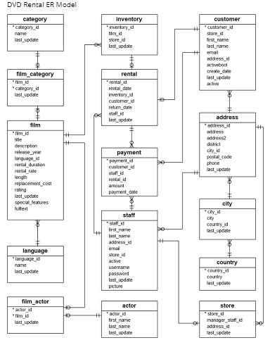

```{r setup, include=FALSE}
knitr::opts_chunk$set(echo = TRUE)
```


# 0. 분석 전에..

 분석 대상이 되는 데이터 베이스는 DVD를 대여해주는 점포의 각종 영업정보에 관한 것이다. 데이터베이스는 총 15개의 데이터셋으로 되어있고 다음과 같은 데이터 스키마를 가진다.  
 

 한눈에 보기에도 복잡한 데이터 이지만 주어진 문제를 중심으로 차근차근 데이터에 대한 이해해보려 한다.  

 아래는 R에서 PostgreSQL을 불러오기 위한 절차이다. 패키지를 불러오고 데이터베이스에 연결을 해줘야한다.  
```{r}
library(RPostgreSQL)
library(DBI)

pgdrv <- dbDriver("PostgreSQL")

con <- dbConnect(pgdrv, dbname="dvd", 
                 port="5432", 
                 user="postgres", 
                 password="tce9et8qw!", 
                 host="localhost")

```
 추가적으로 불러온 테이블을 이용해서 좀더 탐색적 자료분석을 시행하기 위해 시각화 패키지와 데이터 핸들링 패키지를 불러왔다.  
```{r}
library("tidyverse")
library("ggplot2")
library("scales")
```

 이제 분석을 진행할 준비가 되었다.


# 1. What are the top and least rented (in-demand) genres and what are their total sales?

문제의 물음은 가장 많이, 혹은 적게 대여된 장르가 무엇인지와 그 장르들의 총 판매량에 관해서이다.  
그에 대한 테이블을 짜내는 쿼리는 다음과 같다.  
```{r}
genre <- dbGetQuery(con, 
"WITH t1 AS (SELECT c.name AS Genre, count(cu.customer_id) AS Total_rent_demand
            FROM category c
            JOIN film_category fc
            USING(category_id)
	    JOIN film f
            USING(film_id)
            JOIN inventory i
            USING(film_id)
            JOIN rental r
            USING(inventory_id)
            JOIN customer cu
            USING(customer_id)
            GROUP BY 1
            ORDER BY 2 DESC),
     t2 AS (SELECT c.name AS Genre, SUM(p.amount) AS total_sales
            FROM category c
            JOIN film_category fc
            USING(category_id)
            JOIN film f
            USING(film_id)
            JOIN inventory i
            USING(film_id)
            JOIN rental r
            USING(inventory_id)
            JOIN payment p
            USING(rental_id)
            GROUP BY 1
            ORDER BY 2 DESC)
SELECT t1.genre, t1.total_rent_demand, t2.total_sales
FROM t1
JOIN t2
ON t1.genre = t2.genre")
```
 위의 쿼리를 통해 불러온 결과물은 아래와 같다.  
```{r result="markup" }
genre
```
 
 가장 많이 빌려간 장르는 스포츠 장르이며, 가장 적게 빌려간 장르는 음악 장르이다.  
 그러나 최고 인기 장르와 최저 인기 장르의 차이는 2/3 정도에 불과하므로 그렇게 심한 차이는 아니라고 볼 여지가 있다. 총 장르수가 14개 인만큼, 최고 수치의 ~66% 안에 14개의 장르가 분포해있기 때문이다.  
 조금더 직관적으로 보기위하여 bar graph를 그려보았다.  
```{r fig.width = 10}
genre %>%
        ggplot(aes(x= reorder(genre,total_rent_demand),y=total_rent_demand)) +
             geom_bar(stat="identity",color="red") + xlab("장르명") +ylab("총 대여 횟수")
```
 
 눈으로 보기에 가장 인기가 많은 장르와 그렇지 않은 장르사이에 심각할 정도의 차이는 없다는 것을 알 수 있다.  
 다음으로 스포츠장르와 음악 장르의 총 대여액수를 살펴보면 스포츠가 4892.19, 음악이 3071.52이라는 것을 알 수 있다. 대여액수도 마찬가지로 2/3 정도의 차이가 나므로 장르의 편중이 심각한 수준은 아니라고 볼 수 있다.  
 
# 2. Can we know how many distinct users have rented each genre?
 두번째 물음에 대한 쿼리는 다음과 같다. 우선 장르별로 대여기록을 모두 뽑아온 뒤 각 대여기록의 고객 ID 중 겹치지 않는 distict한 유저의 수를 셈으로써 어떤 장르가 최대한 많은 고객을 유인하는 지에 대해 알 수 있다. 
```{r}
mania <- dbGetQuery(con,"
SELECT c.name AS Genre, count(DISTINCT cu.customer_id) AS Total_rent_demand
FROM category c
JOIN film_category fc
USING(category_id)
JOIN film f
USING(film_id)
JOIN inventory i
USING(film_id)
JOIN rental r
USING(inventory_id)
JOIN customer cu
USING(customer_id)
GROUP BY 1
ORDER BY 2 DESC")
```
 위의 쿼리에 대한 결과물은 아래와 같다.  
```{r}
mania
```
 가장 많은 고객이 빌려간 장르는 마찬가지로 스포츠 장르이다. 역으로 가장 적은 수의 사람이 빌려간 장르는 여행 장르이다.  
 1번의 테이블과 2번의 테이블을 이용해 빌린횟수/빌려간사람 으로 다시 비율을 만들어주면 장르의 고객당 평균 대여횟수(average_rental_frequency)를 알수 있을것으로 보인다.
```{r}
mania_ratio = inner_join(mania,genre,by="genre")
result = mania_ratio %>%
        mutate(average_rental_frequency=total_rent_demand.y/total_rent_demand.x)
result[,c("genre","average_rental_frequency")]
```
 고객당 평균 대여횟수가 가장 높은 장르는 애니메이션 장르이다. 애니메이션을 빌린 고객은 평균적으로 2.3권을 빌린다. 반면 음악 장르는 평균 1.85권을 빌린다.  
 위의 두 분석 결과를 복합적으로 해석하면 가장 많은 고객이 빌려간 스포츠 장르는 넓은 고객층을 가지고 있고 고객당 평균 대여횟수가 가장 높은 애니메이션은 충성도 높은 고객층을 가지고 있다고 볼 수 있다. 

# 3.What is the average rental rate for each genre? (from the highest to the lowest)
 문제에서 물어본 내용은 영화 한편당 평균 대여비이다. 이를 확인하는 쿼리는 다음과 같다. 
```{r}
rate <- dbGetQuery(con,"
SELECT c.name AS genre, ROUND(AVG(f.rental_rate),2) AS Average_rental_fee
FROM category c
JOIN film_category fc
USING(category_id)
JOIN film f
USING(film_id)
GROUP BY 1
ORDER BY 2 DESC")
rate
```
 테이블을 본 결과 게임과 영화장르가 가장 비싸고 액션과 다큐멘터리 장르가 가장 낮다. 1번에서 구한 장르별 인기도(장르별 대여횟수)를 순위로 하여 시각화를 해보면 유의미한 분석이 될것이다. 
```{r fig.width = 10}
inner_join(rate,genre,by="genre") %>%
        ggplot(aes(x=reorder(genre, total_rent_demand),y = average_rental_fee)) +
        geom_bar(stat="identity")+scale_y_continuous(limits=c(2,4),oob = rescale_none)+
        xlab("genre") + 
        ylab("편당 평균 대여비")
```
 위의 그림을 보면 편당 대여비와 인기장르간에는 그다지 큰 상관성이 없음을 알 수 있다. 따라서 고객이 DVD의 장르를 선택하는데에 있어 대여료는 그렇게 큰 문제가 아니라고 볼 수 있다.  

# 4.How many rented films were returned late, early, and on time?

 예제에서 주어진 코드를 그대로 돌리니 오류가 발생하였기 때문에 데이터의 전반부를 SQL을 써서 불러온 다음 dplyr을 이용해서 처리를 해주기로 했다. 우선 분석에 필요한 데이터 셋을 만드는 과정은 다음과 같다.  
```{r}
returned <- dbGetQuery(con,"Select *, DATE_PART('day', return_date - rental_date) AS date_difference FROM rental")

duration <- dbGetQuery(con,"
SELECT f.rental_duration , r.rental_id
FROM film f
JOIN inventory i
USING (film_id)
JOIN rental r
USING (inventory_id)")

returned = inner_join(returned,duration,by="rental_id")

returned = returned %>%
        mutate(type = if_else(date_difference>rental_duration,"Late", if_else(date_difference<rental_duration,"Early","On time")))
head(returned[c("rental_id","type")])
```

 이를 그룹화해서 전체 반환현황을 반환하면 다음과 같다
```{r}
returned %>%
        group_by(type) %>%
        summarise(count=n())
```
 결과물을 보니 일찍 반환된경우가 7700번, 늦게 반환된 경우가 6400번으로 일찍 반환된 경우가 더 많았지만 늦게 반환된 경우도 대략 $\frac{6400}{7700} \simeq 83%$ 정도로 만만치 않게 많은것을 확인할 수 있다.  
 그러나 결과물에는 NA값이 180개 발견되었다. 따라서 이들이 어떤 자료인지 확인하기 위해 다음과 같이 반환해주었다. 

```{r}
head(returned[is.na(returned[,c("type")]),])
```
 자료들을 확인해보니 NA가 반환된 이유는 처음부터 return_data(;반환일)이 누락되어 있었기 때문인걸로 보인다. 그러나 NA의 값이 전체에 비해 얼마 되지않는 만큼 위의 분석을 그대로 이어나가도 될것으로 보인다.  

# 5.In which countries does Rent A Film have a presence and what is the customer base in each country? What are the total sales in each country? (from most to least)
 customer_base가 의미하는 것은 각 나라에 있는 고객 ID의 개수이며 total_sales는 나라마다의 판매 총액이다. 이를 알아보기 위해 쿼리를 짜면 다음과 같다.
```{r}
country <- dbGetQuery(con,"
SELECT country, count(DISTINCT customer_id) AS customer_base, SUM(amount) AS total_sales
FROM country
JOIN city
USING(country_id)
JOIN address
USING(city_id)
JOIN customer
USING (address_id)
JOIN payment
USING(customer_id)
GROUP BY 1
ORDER BY 2 DESC;")
head(country)
```
 고객이 가장 많은 국가는 인도와 중국이다. 이들 국가는 판매총액에 있어서도 1,2위를 차지하고 있다.  
 재미삼아 한국도 찾아봤는데, 한국에는 5명의 고객ID가 있었고 북한에도 1명의 고객이 있었다.  
 겉으로 볼때 고객수$\times$100 정도가 total sales를 이루고 있어 고객수와 판매금액의 산점도를 그려보았다.  
```{r}
lr = lm(total_sales~customer_base,data=country)
country %>%
        ggplot(aes(x= customer_base,y=total_sales)) +geom_point() +
        geom_abline(intercept =lr$coefficients[1],slope=lr$coefficients[2])

```
 
 산점도를 통해서 봐도 거의 일직선상에 모든 직선이 위치한다. 회귀선의 요약정보는 다음과 같다.   
```{r}
summary(lr)
```
 예상한대로 거의 고객수의 100배가 판매총액이며 결정계수가 무려 99%에 달하므로 어떤 나라 고객 수의 100배가 그 나라에서 벌어들이는 판매총액이라고 말할 수 있다.  
 
# 6.Who are the top 5 customers per total sales and can we get their details just in case Rent A Film wants to reward them?
 문제에서 요구한대로 5명의 최우량 고객을 찾는 쿼리는 아래와 같다.   
```{r}
best_customer <- dbGetQuery(con,"
WITH t1 AS (SELECT *, first_name || ' ' || last_name AS full_name
		    FROM customer)
SELECT full_name, email, address, phone, city, country, sum(amount) AS total_purchase_in_currency
FROM t1
JOIN address
USING(address_id)
JOIN city
USING (city_id)
JOIN country
USING (country_id)
JOIN payment
USING(customer_id)
GROUP BY 1,2,3,4,5,6
ORDER BY 7 DESC
LIMIT 5;")
best_customer
```

 특이한 점은 가장 많이 빌린 고객은 Reuion이라는 국가의 Saint-Denis라는 곳에서 살고 있었는데, 전혀 처음 들어보는 국가라 한번 찾아보았다.  


 Reunion은 프랑스의 속령으로 프랑스어로 레위니옹이라고 읽힌다. 마다가스카르의 동쪽에 있는 섬이며 인구가 86만명에 불과한 외진 섬이다. 이런 곳에서 대여회사의 최우량 고객이 나왔다는 건 제법 흥미로운 일이다. 


